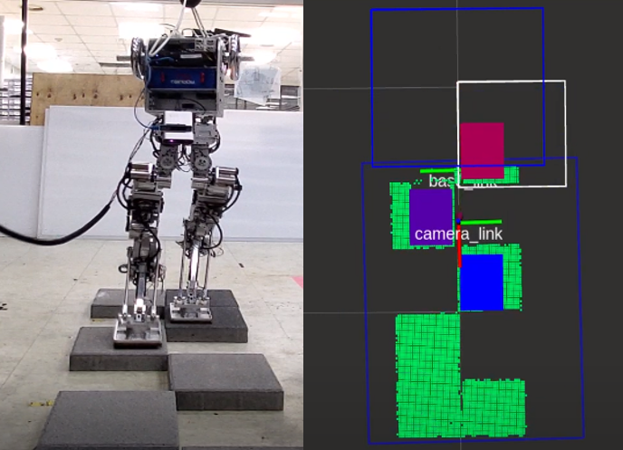

# terrain_mapping_depth



## Overview
Integration of mapping, footstep planning, FSM, and ROSPODO API for Gazelle bipedal robot.
Please refer to summarized slides: https://docs.google.com/presentation/d/13FurmYE9gjpi1eRwqTC1LY8cl4HELHUkI5JosSRJLZ8/edit 

## Install

install ROS Octomap and RViz plugins
```
$ sudo apt-get install ros-melodic-octomap*
```

install quadmap library
```
$ cd ~/Downloads && git clone https://github.com/PinocchioYS/SuperRay.git
$ mkdir SuperRay/build && cd SuperRay/build
$ cmake ..
$ sudo make install
```


## Running

```
$ roslaunch vision_sensor.launch 
$ roslaunch vision_walk.launch 
$ rosrun gogo_gazelle client_NP

```
